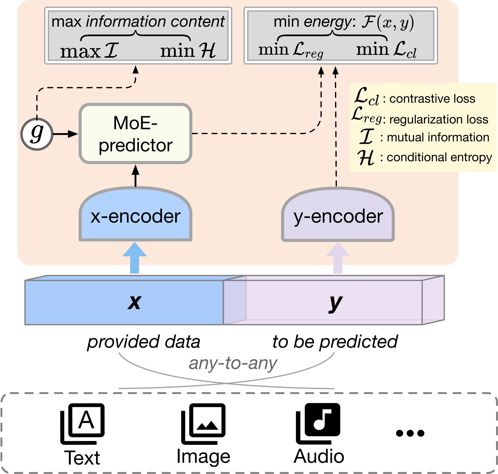
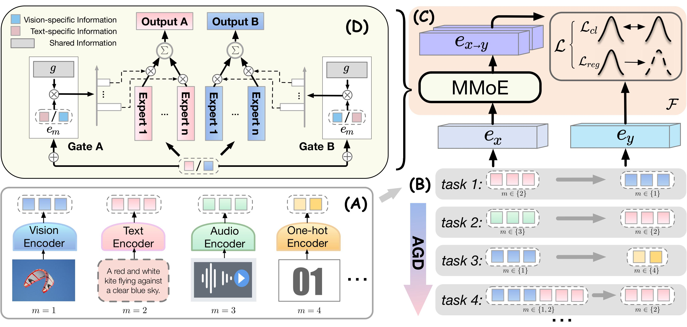

# 🔍 M3-Jepa: Multimodal Alignment via Multi-directional MoE based on the JEPA framework
📢 **Published in**:  
**Proceedings of the Forty-second International Conference on Machine Learning (ICML), 2025**

**M3-Jepa** is a scalable multimodal alignment framework that moves beyond token-level matching by aligning representations in the **latent space**. Built upon the Joint-Embedding Predictive Architecture (JEPA), M3-Jepa introduces a **multi-directional Mixture-of-Experts (MoE)** predictor and optimizes alignment via alternating uni-directional tasks. This approach maximizes mutual information and effectively mitigates modality bias. Extensive experiments show that M3-Jepa achieves **state-of-the-art performance**, strong generalization across unseen modalities and domains, and high computational efficiency. M3-Jepa offers a promising path for **self-supervised multimodal learning** and **open-world understanding**.

## 🚀 Highlights

- ✅ We propose a novel modality-agnostic multi-modal alignment paradigm, with the alignment conducted on the latent space, which is computationally efficient especially when employed as a retriever.
- ✅ We leverage multi-directional MoE as the cross-modal connector, optimizing by alternating the gradient descent between different unidirectional alignment task.
- ✅ We derive an information-theoretical explanation analysis, demonstrating the optimality of M3-Jepa.
- ✅  Our experimental results demonstrate remarkable multi-modal alignment accuracy and efficiency, encompassing text, image and audio modalities.

## 📄 Paper

**M3-Jepa: Multimodal Alignment via Multi-directional MoE based on the JEPA framework**  
👨‍💻 *Hongyang Lei, Xiaolong Cheng, Qi Qin, Dan Wang, Huazhen Huang, Yetao Wu, Qingqing Gu, Luo Ji*  
📍 Accepted at **ICML 2025 (Forty-second International Conference on Machine Learning)**

- 📄 [arXiv (2409.05929)](https://arxiv.org/pdf/2409.05929)  
- 📝 OpenReview: *coming soon*  
- 🔗 ICML Proceedings: *coming soon*

## 🔍 Overview of M3-Jepa
The paradigm of M3-JEPA on any-to-any multi-modality tasks. The self-supervised learning is conducted with two encoding branches of input and output signals, as well as an MoE predictor which projects the input embedding into the output latent space. M3-JEPA is an energy-based model that minimizes both contrastive and regularization losses. M3-JEPA is also conditioned on the inherent information content ($g$) which maximizes the mutual information and minimizes the conditional entropy.
<p align="center">
  
</p>

Architecture of M3-Jepa: input and output are encoded by modality encoders and aligned on the latent space. A connector consisting of a multi-directional MoE is employed to project the input latent vector to the output space. The optimization is alternated between different uni-direction tasks step by step, and both contrastive learning (CL) and prediction learning (Pred) are implemented by loss components. The text-vision tasks are depicted as an experiment in the figure.
<p align="center">
  
</p>

## 🛠 Installation

```bash
# Clone the repository
git clone https://github.com/HongyangLL/M3-JEPA.git
cd m3-jepa

# Install dependencies
pip install -r requirements.txt
```

## 📌 TODO

- [ ] Release the initial version of M3-Jepa
- [x] Add arXiv citation and ICML acceptance info
- [ ] Release official ICML OpenReview and Proceedings links
- [ ] Upload training scripts and pretrained checkpoints
- [ ] Provide inference demo notebook
- [ ] ...
## 📚 Citation

If you find this work useful in your research, please consider citing our paper:

```bibtex
@article{lei2024alt,
  title={Alt-MoE: Multimodal Alignment via Alternating Optimization of Multi-directional MoE with Unimodal Models},
  author={Lei, Hongyang and Cheng, Xiaolong and Wang, Dan and Qin, Qi and Huang, Huazhen and Wu, Yetao and Gu, Qingqing and Jiang, Zhonglin and Chen, Yong and Ji, Luo},
  journal={arXiv preprint arXiv:2409.05929},
  year={2024}
}

